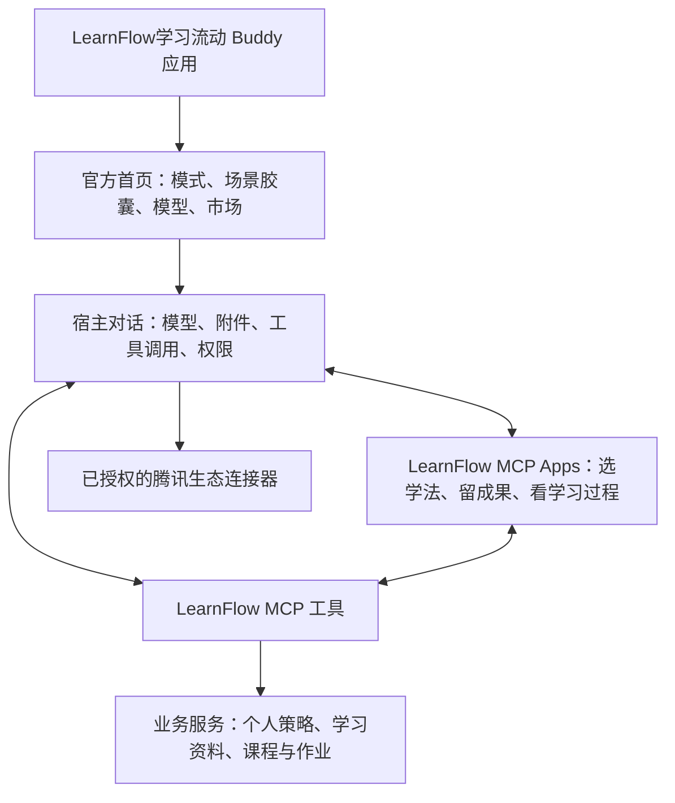

# LearnFlow学习流动：Buddy 应用产品路线图

更新时间：2026-09-09。

本路线以用户提供、并经官方网页交叉核验的 Buddy 应用规范为依据。产品主线为 LearnFlow学习流动 Buddy 应用；已有网页是交互与业务功能的复用来源。下面明确区分平台已说明的能力、当前仓库已有的组件和拟开发内容，不把配置源稿视作已审核应用。

## 1. 先把判断纠正

**Buddy 应用具有明确的产品配置空间。不能任意改宿主程序，不等于只能安装几份提示词。**

官方文档允许配置身份与品牌、首页标题、工作模式、场景胶囊、模型组合、垂直能力市场，并通过 MCP Apps 将现有服务接入对话流。LearnFlow 可以围绕这些入口，形成自己的学习工作台。

此前在本机 LearnBuddy 5.3.8 普通插件入口遇到的限制，只能证明该版本、该入口没有显示 LearnFlow 面板。它不能推导为正式 Buddy 应用没有内嵌交互能力。仓库中的 9 月 6 日宿主检查属于历史实测；正式应用需通过控制台提供的预览链接，在匹配版本的客户端重新验收。

正确的产品描述：**把可选择、可解释、可保存、可分享的学习策略，做成腾讯 Buddy 生态中的自主学习工作台。**

“以后与腾讯合作改进 LearnBuddy”可以保留为合作愿景；LearnFlow 首次发布不以腾讯接受整体改版为前提。

依据：[腾讯 Buddy 应用文档](https://open.workbuddy.cn/docs/buddy-app)。

## 2. 哪些地方可以发挥

| LearnFlow 想做的事 | 实现位置 | 可发挥的部分 | 边界与验收 |
|---|---|---|---|
| F 标识、名称、欢迎语、输入提示 | 官方应用及首页配置 | 统一品牌和第一步引导 | 官方框架内的配置，不承诺全局字体、任意首页布局和侧栏结构可改 |
| 应试、自学、PBL 的不同教学方式 | 工作模式 + System Prompt + 绑定 Skill | 提问顺序、讲解深度、证据要求、输出流程 | 模式绑定的规则怎样与用户临时选择合并，需实测 |
| 点一下就开始具体学习 | 场景胶囊 | 场景文案、提示词、专家/Skill/案例组合 | 模式负责长期规则，胶囊负责启动具体任务 |
| 学习策略市场、教师专家、腾讯工具入口 | 垂直行业市场 | 资产选择、分类、案例、专家与专家团 | 自建社区评分、卡片布局和自动上架机制不是已知原生字段 |
| 模型列表、默认项和顺序 | 官方模型配置 | 从平台模型池选择并排序 | 可配置列表不等于获得所有模型权限，也不等于推理免费 |
| 逐题问卷、策略详情、确认保存、学习资料 | MCP Apps 面板 + MCP 工具 | 自己的 HTML/CSS/JS 交互及业务状态 | 受宿主容器和权限约束；需验证实际客户端、尺寸、消息回传和存储 |
| 可拖动的 3D 策略卡 | MCP Apps 面板候选 | 复用现有展示及卡片数据 | 需验证 WebGL、资源加载、手势和性能；普通卡片视图作为兼容入口 |
| 个人策略版本、学习块和复习记录 | LearnFlow 业务服务 | 数据结构、版本关联、用户确认、导入导出、使用记录 | 不能默认读取全部宿主记忆或历史对话；只处理可访问且已获授权的数据 |
| 教师邀请、提交、人工核验、针对性作业 | 教师 MCP Apps 面板 + 课程服务 | 课程和提交关系、证据表、教学 Skill、作业流程 | 多人在线协作需要真实身份与持久后端；现有本机演示不能直接当成在线课堂 |
| QQ 提醒、远程任务、腾讯文档 | 已授权的宿主连接器或正式服务连接器 | 任务内容、提醒规则、完成回执与跟进 | 网页扫码与宿主绑定不能互相冒用；送达、已读、自报完成、教师确认需分别记录 |

综合判断：**教学流程和学习业务的发挥空间大；自己的交互面板有较大空间但需要宿主实测；宿主全局外观受平台框架约束。** 不用一个没有测量依据的百分比来描述。

MCP Apps 允许在对话中显示交互式 HTML，并通过协议交换数据；它运行在宿主控制的沙箱中，不能任意修改父页面。标准包含可视化和 3D 示例，但具体宿主支持情况仍须验证。[MCP Apps 官方说明](https://modelcontextprotocol.io/extensions/apps/overview)

## 3. LearnFlow 的产品结构

这是一套目标结构，不是所有箭头已经实现。面板通过宿主提供的 MCP Apps 通道与工具交换数据；远程业务服务与桌面本地文件能力分别设计，不让云端服务直接寻找用户电脑上的文件。

进入正式 Buddy 应用后的聊天，优先使用宿主已有的模型和附件入口。网页为了连接本地客户端制作的“连接助手”，仍可服务独立网页版；它不应成为 Buddy 应用用户开始学习的必经安装步骤。

Skill 负责“怎样教和怎样调用工具”；MCP 工具负责“做什么操作、保存什么状态”；MCP Apps 负责“用户怎样看、选择和确认”。三者互补。Skill 不需要改名为 MCP 才能适应模型更新，兼容性来自清晰流程、稳定工具契约和跨模型回归验证。

## 4. 首版内容：三个工作模式，七个高频入口

沿用已有三个模式，优先把具体任务做顺；教师先作为专家与场景入口接入，完整在线课程作为后续交付阶段。

| 模式 | 建议场景胶囊 | 完成时用户拿到什么 |
|---|---|---|
| 复盘错题 | 用词根串起这组单词 | 一个词族、一轮回忆检查 |
| 复盘错题 | 复盘一道六级阅读题 | 原文证据、错误原因、一题迁移练习 |
| 学点新的 | 讲懂一个卡住的概念 | 自己的解释、关键缺口、一个新例子 |
| 学点新的 | 把学习目标拆成第一步 | 先修关系、今天能完成的小成果 |
| 把项目做出来 | 从选题走到作品 | 驱动问题、任务分工、成果标准 |
| 把项目做出来 | 给老师一份学习过程 | 学生选择提交的材料、证据和待核验项 |
| 学点新的 | 把好用的方法留下 | 可编辑、经本人确认的个人策略 |

同一张策略应对用户说明：适用问题、具体步骤、示范、可能不适用的情形、当前版本，以及可以修改的部分。不要把可选择的学法都强绑成模式级常驻规则；否则卡片“关闭”以后可能仍由模式提示词继续生效。

建议将模式常驻规则收敛为：尊重用户目标、明确证据来源、先确认再持久保存、自然表达。费曼法、词根法、追问强度等按场景和用户选择加载，并在两个模型上检查启停是否真实生效。

## 5. 按验收结果推进，不按猜测的天数推进

### G0：先证明正式预览入口能承载产品

**现在可以做：**整理现有组件、制作一个最小 MCP Apps 探针、准备模式和场景配置；企业认证与创建应用权限并行办理。

**获得所需控制台权限后做：**使用平台预览链接及对应 WorkBuddy 客户端，测试下列动作：

1. 从 LearnFlow 场景胶囊进入，模式规则实际生效。
2. 模型调用工具，真实显示一个交互式学习面板。
3. 用户选择“词根法”，选择结果能回到当前对话并影响下一轮学习。
4. 模型生成策略草稿，用户在面板修改、确认或取消。
5. 只有本人确认后才持久保存；新会话能找回该策略。

**交付证据：**真实预览录像、导出的官方配置、脱敏工具结果、客户端版本与测试结论。

**放行条件：**官方预览中面板展示和双向交互通过。没有权限时可继续组件开发，但不能把独立浏览器或测试宿主截图写成此项已通过。

这是最先需要消除的不确定性。若特定客户端未支持，先获得平台支持的版本、示例或实际限制，保留标准面板实现和对话入口，不去修改客户端程序。

### G1：把一个学习流程做完整

以六级阅读复盘或词根词汇学习为样例，串起：

**材料 → 本人尝试 → 针对性引导 → 迁移练习 → 学习块草稿 → 本人确认 → 下次复用。**

验收：至少两个实际可用的宿主模型；测正常完成、取消保存、切换策略、附件失败、超时重试和下次找回。用量以真实返回值记录，不可得时标注未知，不补造数字。

交付：版本固定的 Skill、工具、面板和一份可复现样例。先完成这个流程，再将同一套能力用于另外两个学习模式。

### G2：迁移网页里的核心资产

按对学习主流程的作用排序迁移：

1. 逐题入门与学习偏好。
2. 策略详细说明、实例、选择、编辑与版本。
3. 学习块、个人策略的确认保存。
4. 学习资料列表、授权导入、再次打开。
5. 已采纳策略和可用的真实使用记录。
6. 3D 卡片浏览与动效。

网页的业务数据、样式、卡片组件可以复用；浏览器自己的本地存储、连接助手调用和整套聊天外壳需要适配，不能把网页 URL 填入后就视为完整接入。

验收：在宿主面板里操作后，模型能使用选中的学法；退出再进入数据还在；取消操作没有残留写入。资料打开若需本机 WPS，由已授权的本地工具或宿主文件能力执行，远程面板本身不能直接启动用户电脑程序。

### G3：上线可运营的服务与 QQ 连接

首版公开服务建议采用一个可维护的后端，而不是拆一堆独立服务：

- 一个 HTTPS MCP/业务服务：提供策略、学习块、课程等工具接口。
- 一个持久数据库：保存账号映射、权限、个人策略、版本和任务状态。
- 需要存放用户 PDF 时再接文件存储：明确配额、访问权限与删除方式。
- 需要独立定时提醒时增加任务调度与重试记录；可用宿主原生能力时先复用。

运维至少包括登录失效处理、请求限流、错误监控、备份恢复、数据导出/删除和费用告警。可以用托管服务或自租服务器；这些业务计算通常不要求自购 GPU 或自建模型服务。具体规格和费用按实际试用负载选择，本路线不虚报月费。

腾讯连接器文档支持远程 HTTPS MCP，以及本地 stdio。涉及用户数据需要认证；Buddy 首次进入自动内置的连接器，文档明确提出 OAuth 要求。将远程 OAuth MCP 作为公开版自动绑定的实现路径，不把本地扫码或开发者自己的登录态分发给所有用户。[连接器规范](https://open.workbuddy.cn/docs/connector)

授权分别验收：Buddy 应用授权、LearnFlow 服务绑定、QQ 等业务能力授权。能复用已授权连接就复用；缺失授权时才引导用户完成该项。文档存在“跳过首次绑定”的条件说明，不能由此默认任何非 OAuth 连接器都能自动内置，应以控制台组合与预览结果确认。

QQ 首个验收流程：本人绑定 → QQ 发来学习任务 → 宿主处理 → 结果回到正确会话/任务 → 用户订阅一次提醒 → 查询或取消。测试提醒需获收件人授权。当前网页 QQ 实测不能替代正式 Buddy 这条链路的验收。

### G4：完成正式配置与首版发布

发布依赖顺序：

**取得所需主体/创建权限 → 创建应用及基础信息 → 创建审核通过 → 绑定实际生态资源、配置五个模块 → 指定客户端预览 → 配置审核 → 正式发布。**

现有源稿回填真实应用 ID、已上架或可引用的资产 ID、模型 ID、回调地址和可信 Origin。导出平台自己的配置 JSON 做版本备份；本项目的 app.config.source.json 只是填表源稿。更新发布也应经过平台规定的审核。[发布流程](https://open.workbuddy.cn/docs/buddy-app)

提交前需要：品牌素材、场景使用示例、组件版本、权限说明、数据处理说明、测试账号或平台要求的验证方式，以及明确的失败提示与回退操作。是否需要额外材料，以实际账号和所选服务类目的控制台要求为准。

### G5：将教师端和策略社区做成真实多人产品

教师端完成：课程创建与邀请 → 学生自主选择提交范围 → AI 按教学 Skill 生成证据分析 → 教师核验和修改 → 发布个性化作业 → 学生提交 → 教师确认。

这里新增的是账号与角色权限、跨设备数据、课程成员管理、提交与作业状态，不只是再画一个页面。不能默认 MCP 获得全部聊天历史；优先提交用户主动选择的对话、产物及可取得的用量记录。

策略社区完成：策略投稿 → 来源与版本 → 审核 → 分享与采纳 → 使用反馈 → 新版本。个人策略只有主动发布才进入公共库。评分是使用反馈，Token 是资源使用信息；都不能单独证明掌握程度或教学效果。

宿主内每轮 Token、整段对话导出、单轮积分扣费是否能提供给应用，是独立的能力验证项。公开版只展示获准接口真实提供的字段，不能拿本机网页日志代替宿主账单。

## 6. 当前资产与主要缺口

2026-09-09 已只读检查本地仓库：

| 现有资产 | 当前状态 | 下一步 |
|---|---|---|
| 网页 MVP 与学习卡片界面 | 已有实现，可作为迁移来源 | 抽离学习业务组件，接 MCP Apps 通道 |
| 3 个工作模式、7 个胶囊 | buddy-app/app.config.source.json 和 modes/ 中已有源稿 | 调整常驻与按需 Skill，映射真实平台资源 |
| 11 个 Skill、4 个专家候选 | 本地组件已有 | 更新描述、用例、版本与实际审核状态 |
| 12 个 MCP 工具 | 已有策略查询、草稿、资料等实现 | 适配远程部署与身份；不能原样把 Windows 保存窗口搬到云端 |
| MCP Apps 学习面板 | workspace.html 已有协议交互、逐题选择、学法回传 | 更新 UI 并在官方指定预览客户端验收 |
| 应用标识、日夜背景 | 已有本地材料 | 按各字段要求检查头像、16px 线性图标与背景规格 |
| 官方应用身份和配置 | 源稿 appId/clientId/预览链接为空，hostPreviewVerified 为 false | 取得权限并完成平台配置，不视为已创建/发布 |
| 教师在线协作、社区与同步 | 当前网页主要为本地演示/文件交换 | 开发身份、持久后端、授权和真实多人链路 |

这里的“已有”是文件与历史验证记录的状态，不代表本次重新进行了真实模型、QQ 发送或官方预览测试。

## 7. 最优先待明确的三个问题

1. **预览入口：**你当前账号何时能取得 Buddy 草稿及匹配客户端？该入口中 LearnFlow 的 MCP Apps 是否可正常显示和回传？
2. **用量与计费：**宿主模型由谁结算、能否向应用开放真实 Token/积分字段，需以所选应用权限和实际返回确认。模型配置页面本身不回答这个问题。
3. **公共服务绑定：**LearnFlow 远程 OAuth MCP 怎样被内置、取消授权后怎样停止访问；QQ 原生入口怎样与该 Buddy 的任务及会话对应？

开发与这些验证并行。不要先投入大量时间美化全局聊天框，也不把“审核等待中”当作全部停工的理由。

## 8. 项目真正需要积累的东西

学习流程的质量、可解释的策略库、本人确认后的个性化版本、可核验的学习产物，以及老师能使用的证据，是 LearnFlow 自己的资产。平台配置提供入口，业务工具把流程执行稳定，面板给用户选择权，反馈用于改进下一版。

“可进化”应落实为：记录版本与适用条件、收集经同意的反馈、在同样样例上比较新旧方法、由作者或用户确认升级。它不是模型自动多说几句话，也不是 Token 多就自动判定更好。

## 官方与本地依据

- [Buddy 应用：配置维度、MCP Apps、设计与发布](https://open.workbuddy.cn/docs/buddy-app)
- [连接器：远程与本地运行、认证与版本要求](https://open.workbuddy.cn/docs/connector)
- [Skill 开发规范](https://open.workbuddy.cn/docs/skill)
- [MCP Apps：交互界面、宿主通信与沙箱](https://modelcontextprotocol.io/extensions/apps/overview)
- 本地：buddy-app/app.config.source.json、buddy-app/README.md、buddy-app/mcp/strategy-server.mjs、buddy-app/mcp/workspace.html、buddy-app/host-validation.json。
- 本地历史记录：docs/LEARNBUDDY-INSTALL.md、docs/WORKBUDDY-AUTH-CREDITS.md。历史检查结论须保留适用版本与日期。
